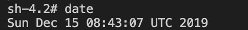

<!-- size: 16:9 -->

<style>
    @font-face
    {
        font-family: monaco;
        src: url('./assets/fonts/monaco.ttf')
    }
    section {
        background:#008C86;
        color:#FFFFFF;
        font-family: 'monaco' 'Monaco';
        justify-content: flex-start;
    }
    h1 {
        position: relative;
        color: #333333;
    }
    h2 {
        margin-top: 0;
    }
    h5 {
        background: #333333;
        color: #FFFFFF;
        text-align: center;
        padding: 5px 0px 5px 0px;
        width: 40%;
    }
    p{ color:#FFFFFF;}
    li {list-style-type: none;}
    li:before {
        content: '';
        width: 6px;
        height: 6px;
        display: inline-block;
        border-radius: 100%;
        background: #FFFFFF;
        position: relative;
        left: -15px;
        top: -5px;
    }
    table {padding: inherit;}
    th {
        background: #D5EBDC;
        color: #2A2B25;
        font-size: 18px;
    }
    td{color: #2A2B25; font-size: 14px;}
    pre {color: #25373D;}
    footer {color: #D6D6D6;}

</style>

<style scoped>
    section {
        justify-content: center;
    }
    p{
        text-align: right;
        margin-top: 10%;
        font-size: 18px;
    }
</style>

# 研究に役立てるLinux Handson

- Linuxとは
- コマンドとシェル
- ...
- ...
- ...
- 研究で役立つLinuxの知識
- Appendix 1. CLIを使う理由

2019.12.15

---

# 目標

## 1. Linuxを研究で役立てられるようにする
- 単純作業の効率化
- 作業ミスをなくす
## 2. シェルスクリプトを使えるようになる
- 言語の一つとして

---

<style scoped>
    h6 {
        margin-bottom:0px;
        margin-top:15px;
        color: #FFFFFF;
    }
    li {
        margin-bottom: 0px;
        margin-top: 0px;
    }
</style>

# 今日やること

- いろいろやります

---

<style scoped>
    h1 {
        text-align: center;
        font-size: 70px;
        height: 100%;
        padding-top: 20%;
    }
</style>

# Linuxとは

---

# Linuxとは

## 概要

- Windows、Macなどと同じOSの一種
- オープンソースソフトウェア
- 家電製品、情報機器の組み込みなど、多くの環境で使われている
- 

---

# Linuxとは

## 特徴

- オープンソースなので、誰でも無性で利用可能
- 世界中でサーバとして使われていて信頼性が高い
- 操作を自動化するための仕組みがあり、運用が行いやすい

## 欠点

- ソフトウェアによっては日本語が文字化けを起こす

---

# Linuxとは

## ディストリビューションってなに

- 狭義のLinux : Linuxカーネルのこと、OSの中核部分のソフトウェア
- 広義のLinux : Linuxカーネルに加えて、コマンドとかアプリケーションを含めてパッケージにしたもの
    - 広義のLinuxの種類が、ディストリビューション
    - 以下の二つが主流
        - Red Hat系(CentOS)
        - Debian系(Ubuntu)

---

<style scoped>
    h1 {
        text-align: center;
        font-size: 70px;
        height: 100%;
        padding-top: 20%;
    }
</style>

# シェルとコマンド

---

<style scoped> h6 {text-align: center;} </style>

# シェルとコマンド

## コマンド例

- 入力

```
$ date
```
- 現在時刻が表示される (UTC)

###### 

---

<style scoped>footer{ display:none; }</style>

# シェルとコマンド

## シェルの役割とLinuxカーネル

### 今内部で起こっていたこと

- `date`という文字列を受け取る
- `date`という名前のコマンドを探す
- 見つかったコマンドを実行する ← Linuxカーネルが行う
- 実行した結果得られた出力結果(現在時刻)を画面に表示する


※ ユーザーが直接Linuxカーネルを操作して`date`を実行したわけではない
※ Linuxカーネルを包み込むように動作するので、shell : 殻

---

<style scoped>footer{ display:none; }</style>

# シェルとコマンド

## シェルとは

- Linuxカーネルとユーザーの間に入るインターフェースのソフトウェア

### さっきの例だと

- *「シェルが」* `date`という文字列を受け取る
- *「シェルが」* `date`という名前のコマンドを探す
- *「Linuxカーネルが」* 見つかったコマンドを実行する
- *「シェルが」* 実行した結果得られた出力結果(現在時刻)を画面に表示する

---

<style scoped> h6 {text-align: center;} </style>

# シェルとコマンド

## シェルスクリプトとは

- 一連のコマンドを記述したファイル

例: 日付を出力するシェルスクリプト

```
#!/bin/sh

today=$(date '+%d')

echo "今日の日付は" $today "日です."
```

###### 

---

<style scoped>
    table {
        width: 100%;
        padding: 0;
        margin-top: 0;
        margin-bottom: 5%;
    }
</style>

# シェルとコマンド

## シェルの種類

|名前|説明|
|--|--|
|`sh`|最も古くから存在するシェル. シェルスクリプトを書く際はshを使うのが最も一般的. 古いので、機能が少なく、対話的に使うには不便. ログインシェル(開いた時の最初のシェル)として使われることは現在ではない|
|`csh`|古くからある、Cシェルと呼ばれるシェル. 文法がshと異なり、スクリプトを書く上では欠陥があるので使われていない.|
|`bash`|shを基本として機能拡張したシェル. 多くのLinux環境でデフォルトのログインシェルとして利用されている.|
|`tcsh`|cshの後継として開発された. 一般ユーザーのプロンプト記号に`%`が使われる.|
|`zsh`|比較的新しいシェルで、bashやtcshなどの他のシェルの機能を取り込んでいる. 慣れれば効率よく作業できるけど、初心者向けではない.|

- 基本的にlinuxのデフォルトのログインシェルである`bash`がおすすめ

---
<style scoped>
    table {
        width: 100%;
        padding: 0;
        margin-top: 0;
        margin-bottom: 5%;
    }
</style>

# シェルとコマンド

## ターミナルとシェルの関係

#### ターミナルとは

- ユーザーがコンピューターに入出力する時に使う専門のハードウェアのこと
※ 現在は、物理的なターミナルをソフトウェアで実装した`ターミナルエミュレータ`が使われている


|OS|ターミナルエミュレータ|
|--|--|
|Windows|PuTTY, Tera Term|
|Mac OS X|ターミナル, iTerm2|
|Linux|GNOME Terminal, Konsole|

---

# シェルとコマンド

## ターミナルとシェルの関係

- ターミナルエミュレータとシェルは全く違うソフトウェア
- ターミナルエミュレータは入出力画面を提供するだけのソフトウェア
- ターミナルエミュレータという窓の中で、Linuxマシンのシェルが動く

---

<style scoped>
    h1 {
        text-align: center;
        font-size: 70px;
        height: 100%;
        padding-top: 20%;
    }
</style>

# シェルの便利機能

---

<style scoped>
    table {
        width: 100%;
        padding: 0;
        margin-top: 0;
        margin-bottom: 5%;
    }
</style>

# シェルの便利機能

### カーソル移動などは`ctrl + ..`を中心に

|コマンド|用途|
|--|--|
|`Ctrl + b`|カーソルを1つ前(左)に移動|
|`Ctrl + f`|カーソルを1つ後ろ(右)に移動|
|`Ctrl + e`|カーソルを行末(一番右)に移動|
|`Ctrl + a`|カーソルを行頭(一番左)に移動|
|`Esc + b`|カーソルを1単語分前に(左)に移動|
|`Esc + f`|カーソルを1単語分後ろに(右)に移動|
|`Ctrl + w`|1単語分(スペースまで)削除する|

※ 十字キーの操作は非効率なので非推奨

---

<style scoped>
    table {
        width: 100%;
        padding: 0;
        margin-top: 0;
        margin-bottom: 5%;
    }
</style>

# シェルの便利機能

### カットとヤンク


|コマンド|用途|
|--|--|
|`Ctrl + k`|カーソルから行末までを削除|
|`Ctrl + u`|カーソルから行頭までを削除|
|`Ctrl + y`|最後に削除した内容を再度挿入|

- `Ctrl + k/u`で削除された内容はシェルに記憶されており、後から取り出せる
    - 単純な削除ではなく、`カット`と呼ばれる
    - `Ctrl + y`はペーストっぽいけど、bashではこれを`ヤンク`と呼ぶ

---

<style scoped>
    table {
        width: 100%;
        padding: 0;
        margin-top: 0;
        margin-bottom: 5%;
    }
</style>

# シェルの便利機能

### 困ったときは


|コマンド|用途|
|--|--|
|`Ctrl + s`|画面表示をロックする|
|`Ctrl + q`|画面表示のロックを解除|
|`Ctrl + c`|実行中のコマンドを強制終了|
|`Ctrl + c`|実行中のコマンドを強制終了|
|`Ctrl + p`|過去のコマンドを表示する ※検索することもできる|

---

<style scoped>
    h1 {
        text-align: center;
        font-size: 70px;
        height: 100%;
        padding-top: 20%;
    }
</style>

# ファイルとディレクトリ

---

<style scoped>
    table {
        width: 100%;
        padding: 0;
        margin-top: 0;
        margin-bottom: 5%;
    }
</style>

# ファイルとディレクトリ

### マウントとは

- ルートディレクトリ配下のどこかに、ディスクをディレクトリとしてくっつける方法のこと

---

# ファイルとディレクトリ

### ディレクトリの役割

|名前|役割|
|--|--|
|`/bin|コマンドの実行ファイル置き場, 重要度の高いコマンドを格納している|
|`/dev`|デバイスファイル(ディスクやキーボードなどのハードウェアをファイルとして扱うためのファイル)を格納する|
|`/etc`|設定ファイル置き場, Linuxを管理、運用する上で非常に重要なディレクトリ|
|`/home`|ユーザごとに割り当てられるホームディレクトリが配置される場所, ホームディレクトリはLinuxのユーザごとに割り当てられる個人用ディレクトリのこと|
|`/sbin|管理者ユーザ向けの実行ファイル置き場|
|`/tmp`|一時的なファイルを置く場所、定期的に削除される可能性があるので、何かを置くのには適していない|
|`/usr`|アプリケーションとその付随ファイルを置く場所. 何かのアプリをインストールした時にここにいろいろ入る. サブディレクトリに`/bin`や`/etc`などを持っている|
|`/var`|ログや電子メールなど、変化するものがここに入る.  要領が逼迫しがちなので、注意が必要|

---


---
---

---
<style scoped>
    h1 {
        text-align: center;
        font-size: 70px;
        height: 100%;
        padding-top: 20%;
    }
</style>

# Appendix

---

<style scoped>
    h3 {
        margin-left: 5%;
    }
</style>

# Appendix

## CLIを使う理由

### 1. 作業効率がよくなる
### 2. GUIの操作を覚えてもあまり意味がない
### 3. プログラムの連携がしやすい
### 4. 処理の自動化がしやすい

---

<style scoped>
    section.split {
        overflow: visible;
        display: grid;
        padding-left: 5%;
        padding-right: 5%;
        grid-template-columns: 50% 50%;
        grid-template-rows: 200px auto;
        grid-template-areas: 
            "head head"
            "leftpanel rightpanel";
    }
    /* debug */
    section.split .tdiv {
        grid-area: head;
    }
    section.split .ldiv { grid-area: leftpanel; }
    section.split .rdiv { 
        grid-area: rightpanel; 
        padding-left: 5%;
        }
</style>

<!-- _class: split -->

<div class=tdiv>

# 理由 1. 作業効率がよくなる
```
例) あるディレクトリの、`a`から始めるファイルを全て選んで
```
</div>

<div class=ldiv>

#####  GUIの場合
- ファイルブラウザの表示を確認
- `a`から始めるファイルを1つずつ頑張ってクリック
</div>
<div class=rdiv>

##### CLIの場合
- `a*`で対象のファイルを選択できる

```
$ ls a*
```
</div>

---

# 理由2. GUIを覚えてもあまり意味がない

- GUIの操作の裏側では、コマンドが実行されていたり設定ファイルが書き換わったりする
- GUIの操作手順はバージョンによって変わりうる
    - スクショの説明書使えなくなってるとか
- 一方`Linux`のCLIは何年も変更されておらず、数年前の情報も利用可能であるケースがいい
    - コマンドとか基本変わらない

##### なので、

- 内部処理であるCLIを学んだ方がより`本質的`で、`基礎知識として役立つ`

---

# 理由3. プログラムとの連携がしやすい

- いろいろなコマンドを組み合わせることで、プログラムを連携できる
- 例) テキストファイルから"abc"を検索して、ソートする

```
grep "abc" sample.txt | sort
```

- `|`: パイプによって、AしたあとBして、そのあとCして...みたいなものを連携可能

##### GUIだと
- 例えば引継ぎが必要な場合、手順一つ一つをスクショとかで残して手順書を作る必要がある

---

<style scoped>
    section.split {
        overflow: visible;
        display: grid;
        padding-left: 5%;
        padding-right: 5%;
        grid-template-columns: 50% 50%;
        grid-template-rows: 100px auto;
        grid-template-areas: 
            "head head"
            "leftpanel rightpanel";
    }
    /* debug */
    section.split .tdiv {
        grid-area: head;
    }
    section.split .ldiv { grid-area: leftpanel; }
    section.split .rdiv { 
        grid-area: rightpanel; 
        padding-left: 5%;
        }
</style>

<!-- _class: split -->

<div class=tdiv>

# 理由 4. 処理の自動化がしやすい
</div>

<div class=ldiv>

#####  GUIの場合
- 繰り返し処理は一つ一つ手作業
- 作業ミスが発生しうる
</div>
<div class=rdiv>

##### CLIの場合
- コマンドをファイルにまとめて実行することで、1コマンドで複数の処理を実行可能
- プログラムに間違えがなければ、作業ミスは理論上発生しない
</div>

---

# メモ

### ファイルを削除できないとき

```
rm <filename>
```
> rm: 'filename' を削除できません: そのようなファイルやディレクトリはありません

- → 他のアプリケーションでそのファイルを開いたりしてるかも？
    - databaseファイルならconnectionを貼ってるとか
    - excelファイルなら開きっぱなし